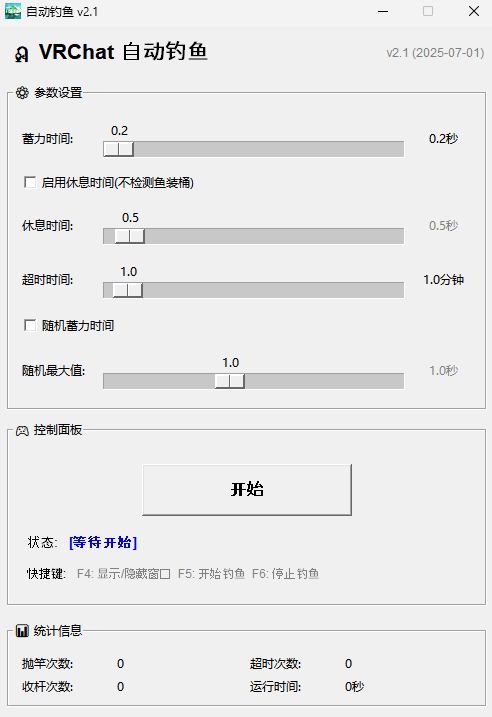

# VRChat 自动钓鱼程序

这是一个用于VRChat的自动钓鱼程序，通过监控VRChat日志文件来检测鱼上钩事件，并自动执行钓鱼操作。



## 🎯 适用世界

本工具适用于VRChat钓鱼世界：

- **世界链接**: [VRChat钓鱼世界](https://vrchat.com/home/world/wrld_ab93c6a0-d158-4e07-88fe-f8f222018faa)
- **世界ID**: `wrld_ab93c6a0-d158-4e07-88fe-f8f222018faa`

## 📖 项目说明

本项目基于 [arcxingye/AutoFisher-VRC](https://github.com/arcxingye/AutoFisher-VRC) 原始代码改进开发，添加了更多功能和更好的用户体验。

## 功能特点

- 🎣 自动检测鱼上钩事件
- ⏱️ 可配置的蓄力时间和休息时间
- 🎲 随机蓄力时间功能（可选）
- ⏰ 超时自动重钓机制
- 🔧 易于配置的参数设置
- 📝 详细的运行日志
- ⌨️ 快捷键支持（F5启动/停止，F6强制停止）
- 🎨 任务栏图标状态显示
- 🖥️ 现代化GUI界面
- 📊 实时统计信息显示

## 使用方法

### 1. 使用exe启动

直接运行Releases的`VRChatAutoFishing.exe`文件。

### 2. 从源码运行

1. 克隆仓库
   
   ```bash
   git clone https://github.com/gujimy/VRChatAutoFishing.git
   cd VRChatAutoFishing
   ```

2. 安装依赖
   
   ```bash
   pip install -r requirements.txt
   ```

3. 运行程序
   
   ```bash
   python auto_fishing_gui.py
   ```

## 基本操作

1. **启动程序** - 运行exe文件或Python脚本
2. **调整参数** - 根据需要调整蓄力时间、休息时间等
3. **开始钓鱼** - 点击"开始"按钮或按F5
4. **停止钓鱼** - 点击"停止"按钮或按F6

### 快捷键

- **F4** - 显示/隐藏窗口
- **F5** - 开始钓鱼
- **F6** - 停止钓鱼

### 参数说明

- **蓄力时间** - 抛竿时按住鼠标的时间（0.2-2.0秒）
- **休息时间** - 每次钓鱼循环之间的休息时间（0.1-10.0秒）
- **超时时间** - 等待鱼上钩的最大时间（1.0-15.0分钟）
- **随机蓄力** - 启用随机蓄力时间，更自然
- **随机最大值** - 随机蓄力时间的最大值

## 📁 项目结构

```
VRChatAutoFishing/
├── auto_fishing_gui.py      # 主程序文件
├── requirements.txt         # Python依赖
├── build.bat                # 编译脚本
├── auto_fishing_gui.spec    # PyInstaller配置
├── ico.ico                  # 程序图标
├── README.md                # 说明文档
└── .gitignore               # Git忽略文件
```

## 新功能说明

### 随机蓄力时间

- 勾选"随机蓄力时间"复选框启用
- 设置随机蓄力时间的最大值（最小值固定为0.2秒）
- 每次抛竿时会在0.2秒到设定最大值之间随机选择蓄力时间

### 任务栏图标

- 程序运行时会在任务栏显示图标
- 关闭窗口时程序会最小化到任务栏继续运行
- 右键点击任务栏图标可以：
  - 显示窗口
  - 开始/停止自动钓鱼
  - 退出程序
- 图标颜色根据当前状态变化

## 版本历史

- **v2.0** (当前版本): 
  - ✨ 添加随机蓄力时间功能
  - ⌨️ 添加快捷键支持（F4显示/隐藏窗口，F5开始，F6停止）
  - 🎨 添加任务栏图标状态显示
  - 📝 添加GUI快捷键说明
  - 🔧 优化用户界面和用户体验
  - 🖥️ 完善最小化到任务栏功能

## 相关链接

- 🌐 **VRChat钓鱼世界**: [https://vrchat.com/home/world/wrld_ab93c6a0-d158-4e07-88fe-f8f222018faa](https://vrchat.com/home/world/wrld_ab93c6a0-d158-4e07-88fe-f8f222018faa)
- 📚 **原始项目**: [https://github.com/arcxingye/AutoFisher-VRC](https://github.com/arcxingye/AutoFisher-VRC)
- 📺 **使用教程**: [B站视频教程](https://www.bilibili.com/video/BV1TqotYrEDe)


